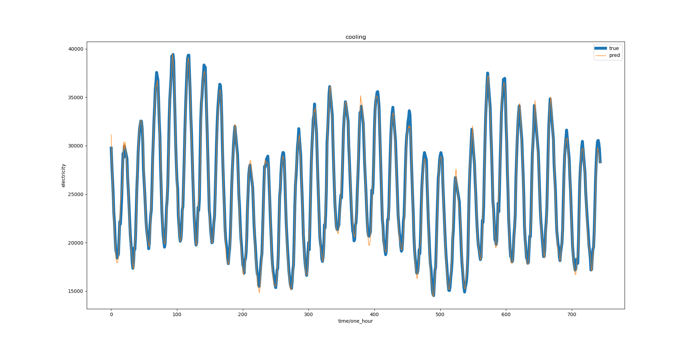

# DMP-PCFC: Dual-Resolution Channel Multi-Period Cross Reconstruction Parallel Closed-Form Continuous-Time Network

[](https://www.python.org/)
[](https://pytorch.org/)
[](LICENSE)

Advanced neural architecture for multi-step energy loads prediction in integrated energy systems, utilizing data from:
- [ASU Tempe Campus IES](http://cm.asu.edu/)
- [NOAA NCEI](https://www.ncei.noaa.gov/)



## 🚀 Getting Started

### Prerequisites
- ​**NVIDIA GPU**​ with CUDA 11.8 support
- Python 3.10.13
- PyTorch 2.0.1
- numpy 1.26.0
- pandas 2.0.3

### Installation
```bash
# Clone repository
git clone https://github.com/nuist-xf/DMP-PCFC.git
cd DMP-PCFC

# Create conda environment
conda create -n dmp-pcfc python=3.10.13
conda activate dmp-pcfc

# Install dependencies
pip install -r requirements.txt

# Run Pipeline

# train（Automatic use of the GPU）
python train.py

# Generate the results of the prediction metrics
python Save_result_multipredict.py
```

## Repository Structure
```
DMP-PCFC/
├── assets/                 # Visualization resources
│   ├── 24-steps/          # 24-hour predictions
│   ├── 48-steps/          # 48-hour predictions
│   ├── 72-steps/          # 72-hour predictions
│   └── 96-steps/          # 96-hour predictions
│
├── data/                  
│   └── dataset_input.csv  # Preprocessed sequence data
│
├── model/                 # Trained model weights
│   ├── 24-steps/model.pt  
│   ├── 48-steps/model.pt  
│   ├── 72-steps/model.pt  
│   └── 96-steps/model.pt  
│
├── result/                # Prediction results
│   ├── 24-steps/          
│   ├── 48-steps/          
│   ├── 72-steps/          
│   └── 96-steps/          
│
├── metrics.py             # Evaluation metrics (RMSE/MAE/MAPE)
├── train.py               # Main training script
├── trainer.py             # Training process management
├── torch_cfc.py           # DMP-PCFC model implementation
├── Save_result_multipredict.py  # Full test set evaluation metrics
├── Save_result.py         # Daily first-moment evaluation metrics
└── util.py                # Data loading utilities
```


## Contact
For technical support or data access requests:
- **Liguo Weng**  
  📧 002311@nuist.edu.cn 
  🏛 Nanjing University of Information Science & Technology

## ⚖️ License
This project is licensed under the [MIT License](LICENSE) - see the LICENSE file for details.
```

